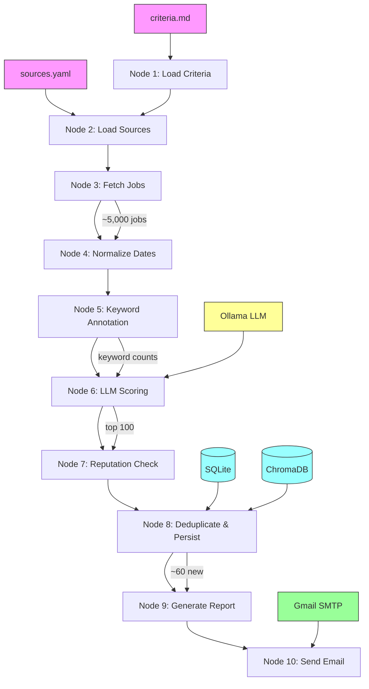

# 🔍 Agentic AI Job Search Agent

> **Version**: 0.1.0 | **License**: MIT | **Python**: ≥ 3.11  
> A fully local, open-source, zero-cost AI job finder that runs entirely on your machine.

---

## Table of Contents

1. [Solution Overview](#solution-overview)
2. [Architecture](#architecture)
3. [Pipeline — 10-Node LangGraph Workflow](#pipeline--10-node-langgraph-workflow)
4. [Quick Start](#quick-start)
5. [CLI Interface](#cli-interface)
6. [Configuration Files](#configuration-files)
7. [Directory Structure](#directory-structure)
8. [Data Models](#data-models)
9. [Job Source Fetchers](#job-source-fetchers)
10. [Agent Intelligence — LLM Scoring](#agent-intelligence--llm-scoring)
11. [Storage Layer](#storage-layer)
12. [Report Generation & Email Delivery](#report-generation--email-delivery)
13. [Python Modules & Dependencies](#python-modules--dependencies)
14. [Testing](#testing)
15. [Scheduling & Automation](#scheduling--automation)
16. [Glossary](#glossary)

---

## Solution Overview

### The Problem

Job seekers in AI/ML face a fragmented landscape — dozens of boards (LinkedIn, Indeed, Greenhouse, Lever, RemoteOK, We Work Remotely), thousands of irrelevant listings, and no unified way to rank jobs by personal relevance. Commercial aggregators track your data and charge for premium features.

### Why This Agent Is Different

| Feature | This Agent | Commercial Tools |
|---|---|---|
| **Cost** | **$0** — fully free and open source | $30–$100/month |
| **Privacy** | **100% local** — no data leaves your machine | Data sold to recruiters |
| **AI Scoring** | **Local LLM** via Ollama (Llama 3) | Cloud APIs with usage fees |
| **Sources** | **50+ sources** via free public APIs/RSS | Limited integrations |
| **Customization** | Fully configurable criteria & sources | Fixed feature set |
| **Scheduling** | Built-in cron/launchd automation | Manual or limited |

### How It Works

1. **Fetches** 5,000+ jobs from 50+ sources via free public APIs and RSS feeds
2. **Annotates** each job with keyword relevance scores — zero API cost
3. **Scores** top 100 candidates using a **local LLM** (Ollama + Llama 3) — runs on your CPU/GPU, no cloud
4. **Deduplicates** using 3 layers: exact URL match, fuzzy title/company match, and semantic vector similarity (ChromaDB)
5. **Generates** a curated HTML + Markdown report split into Remote and Non-Remote sections
6. **Emails** results to you via Gmail SMTP
7. **Runs on a schedule** — daily at 8 AM via macOS launchd or cron

### Technology Stack

| Tool | Role | Cost |
|---|---|---|
| **Python 3.11+** | Runtime | Free |
| **LangGraph** | Orchestrates the 10-node pipeline as a stateful directed graph | Free |
| **Ollama + Llama 3** | Local LLM inference for semantic job scoring | Free |
| **ChromaDB** | Embedded vector database for semantic dedup (ONNX MiniLM embeddings) | Free |
| **SQLite** | Persistent job history, deduplication, run logs | Free (stdlib) |
| **httpx** | Async-capable HTTP client for API fetching | Free |
| **feedparser** | RSS/Atom feed parsing | Free |
| **Pydantic v2** | Data validation and type-safe schemas | Free |
| **Gmail SMTP** | Email delivery via App Password | Free |
| **Docker** (optional) | SearXNG container for company reputation search | Free |

**Total infrastructure cost: $0/month.** Everything runs locally.

---

## Architecture



### Data Flow

```
criteria.md + sources.yaml + .env
        │
        ▼
┌──────────────────────────────────────────────────────┐
│              graph.py (LangGraph Pipeline)            │
│                                                       │
│  Node 1-2: Load config                                │
│  Node 3:   Fetch from 51 sources ──→ ~5,000 jobs     │
│  Node 4-5: Normalize + annotate keywords              │
│  Node 6:   LLM score (Ollama) ──→ top 100            │
│  Node 7:   Reputation check (SearXNG)                 │
│  Node 8:   Deduplicate ──→ ~60 new                   │
│  Node 9:   Render report  ──→ .md + .html            │
│  Node 10:  Send email ──→ Gmail SMTP                  │
└───────┬───────────┬───────────┬───────────────────────┘
        │           │           │
        ▼           ▼           ▼
    ┌────────┐  ┌────────┐  ┌──────────┐
    │ SQLite │  │ChromaDB│  │  Gmail   │
    │jobs.db │  │chroma/ │  │  SMTP    │
    └────────┘  └────────┘  └──────────┘
```

| Stage | Input | Output | Volume |
|---|---|---|---|
| Fetch | 51 source configs | Raw `JobModel` list | ~5,000 |
| Annotate | Raw jobs + keywords | Jobs with `keyword_matches:N` flags | ~5,000 |
| Score | Top 100 by keywords | LLM-scored jobs (or keyword fallback) | 100 |
| Deduplicate | Scored jobs | New unseen jobs | ~60 |
| Report | All matched jobs | Remote + Non-Remote HTML sections | 100 |
| Email | HTML report | Gmail delivery | 1 |

---

## Pipeline — 10-Node LangGraph Workflow

**File**: `src/graph.py`

The pipeline is built using LangGraph's `StateGraph`. All nodes share a `PipelineState` TypedDict.

### Node 1–2: Load Configuration

Reads `criteria.md` → `CriteriaModel` and `sources.yaml` → source list. Overrides `posted_within_days` (1 for daily, 7 for weekly).

### Node 3: Fetch Jobs

Calls the appropriate fetcher for each source type (7 fetcher functions). Each normalizes raw data into `JobModel` instances, inferring employment type, remote status, and salary from text.

### Node 4: Normalize Dates

Parses various date formats (RFC 822, ISO 8601) into ISO format. Flags jobs with `missing_salary`.

### Node 5: Keyword Annotation

All jobs pass through (no filtering). Computes `keyword_matches:N` for each job:

```python
matches = sum(1 for kw in criteria.keywords if kw.lower() in text_lower)
job.flags.append(f"keyword_matches:{matches}")
```

### Node 6: Semantic Scoring (LLM)

Sorts all jobs by keyword count, takes top 100, then:
- **Dry-run**: assigns default score of 5
- **Full mode**: sends each to Ollama LLM with a structured prompt. Falls back to keyword scores if Ollama fails.

### Node 7: Reputation Check

Optionally queries SearXNG for Glassdoor ratings. Assigns reputation score (1–10).

### Node 8: Deduplicate & Persist

Three-layer deduplication:
1. **URL match** — SQLite exact lookup
2. **Fuzzy key match** — normalized `company|title` key
3. **Semantic match** — ChromaDB cosine similarity (threshold 0.92)

### Node 9: Generate Report

Sorts all matched jobs by date (newest first), splits into **🌍 Remote** and **🏢 Non-Remote** sections, renders Markdown + HTML.

### Node 10: Send Email

Sends HTML report via Gmail SMTP. Always sends a report — subject adapts to "X New Matches" or "Report (0 new)".

---

## Quick Start

```bash
# 1. Clone & install
git clone https://github.com/agstya/job-search-agent.git
cd job-search-agent
python -m venv .venv && source .venv/bin/activate
pip install -e ".[dev]"

# 2. Configure
cp .env.example .env    # Edit with your Gmail App Password

# 3. Start Ollama
brew install ollama
ollama pull llama3
ollama serve &

# 4. Run
python main.py --mode daily --dry-run    # Test without LLM scoring
python main.py --mode daily              # Full run with email
```

### Gmail App Password Setup

1. Enable 2-Factor Authentication at [Google Account Security](https://myaccount.google.com/security)
2. Create App Password at [App Passwords](https://myaccount.google.com/apppasswords)
3. Copy the 16-character password into `.env` as `GMAIL_APP_PASSWORD`

---

## CLI Interface

**File**: `main.py`

```bash
python main.py --mode daily               # Jobs from last 24h
python main.py --mode weekly              # Jobs from last 7 days
python main.py --mode daily --dry-run     # Skip LLM scoring
python main.py --mode daily --no-email    # Only generate reports
python main.py --criteria my.md --sources my.yaml  # Custom configs
python main.py --mode daily --log-level DEBUG      # Verbose logging
```

| Flag | Description |
|---|---|
| `--mode daily/weekly` | Search window: 24h or 7 days |
| `--dry-run` | Skip LLM scoring, assign default score 5 |
| `--no-email` | Suppress email sending |
| `--criteria PATH` | Custom criteria file (default: `criteria.md`) |
| `--sources PATH` | Custom sources file (default: `sources.yaml`) |
| `--log-level LEVEL` | DEBUG, INFO, WARNING, ERROR |

---

## Configuration Files

### criteria.md — Search Preferences

```markdown
## Work Arrangement
- Fully remote: yes
- Full-time only: yes

## Compensation
- Minimum salary: 150000
- Maximum salary: 300000

## Roles & Keywords
- Keywords: agentic AI, AI agent, LLM, ML engineer, NLP, generative AI, deep learning
- Seniority: senior, staff, principal, lead, director

## Exclusions
- Exclude keywords: intern, junior, entry level, part-time

## Scoring
- Minimum LLM score: 7
- Max results per email: 100
```

### sources.yaml — Job Board Configuration

51 sources across 7 types:

```yaml
sources:
  - name: RemoteOK
    type: remoteok_api
    url: https://remoteok.com/api
    enabled: true

  - name: Remotive
    type: remotive
    url: https://remotive.com/api/remote-jobs
    enabled: true

  - name: Stripe
    type: greenhouse
    company_slug: stripe
    enabled: true

  - name: Netflix
    type: lever
    company_slug: netflix
    enabled: true
```

### .env — Secrets (gitignored)

```bash
OLLAMA_BASE_URL=http://localhost:11434
OLLAMA_MODEL=llama3
GMAIL_ADDRESS=you@gmail.com
GMAIL_APP_PASSWORD=xxxx xxxx xxxx xxxx
RECIPIENT_EMAIL=you@gmail.com
DB_PATH=jobs.db
CHROMA_PATH=./chroma_db
SEARXNG_URL=http://localhost:8888
SEARXNG_ENABLED=false
LOG_LEVEL=INFO
```

---

## Directory Structure

```
job-search-agent/
├── main.py                     # CLI entrypoint
├── criteria.md                 # Search preferences
├── sources.yaml                # Source configuration (51 sources)
├── pyproject.toml              # Dependencies & project metadata
├── docker-compose.yml          # Optional SearXNG container
├── .env / .env.example         # Secrets
│
├── src/
│   ├── graph.py                # LangGraph pipeline — 10 nodes
│   ├── agents/
│   │   ├── criteria_parser.py  # criteria.md → CriteriaModel
│   │   ├── scoring.py          # Ollama LLM scoring
│   │   └── reputation.py      # SearXNG reputation checker
│   ├── models/
│   │   ├── job.py              # JobModel schema
│   │   ├── criteria.py         # CriteriaModel schema
│   │   └── scoring.py          # LLMScoringOutput schema
│   ├── report/
│   │   ├── renderer.py         # Markdown + HTML renderers
│   │   └── email_sender.py     # Gmail SMTP sender
│   ├── storage/
│   │   ├── database.py         # SQLite repository
│   │   └── vector_store.py     # ChromaDB vector store
│   └── tools/
│       ├── sources.py          # 7 fetcher functions
│       ├── html_cleaner.py     # HTML → plain text
│       └── searx_tool.py       # SearXNG wrapper
│
├── tests/                      # pytest test suite
├── schedule/                   # cron + launchd configs
├── reports/                    # Generated reports (gitignored)
├── logs/                       # Run logs (gitignored)
├── jobs.db                     # SQLite database (gitignored)
└── chroma_db/                  # Vector store (gitignored)
```

---

## Data Models

### JobModel — `src/models/job.py`

Every job from every source is normalized into this Pydantic schema:

```python
class JobModel(BaseModel):
    title: str                          # "Staff AI Engineer"
    company: str                        # "Coinbase"
    url: str                            # Apply link
    source: str                         # "Greenhouse (coinbase)"
    posted_date: str | None             # ISO format
    employment_type: EmploymentType     # full_time, contract, etc.
    remote_type: RemoteType             # remote, hybrid, onsite, unknown
    salary_text: str | None             # Raw salary string
    salary_min: int | None              # Parsed min (annual)
    salary_max: int | None              # Parsed max (annual)
    location: str | None                # "Remote - USA"
    description: str                    # Clean text (HTML stripped)
    flags: list[str]                    # ["keyword_matches:5"]
    llm_score: int | None               # 1-10 from LLM
    llm_reasons: list[str]              # Why matched
    is_match: bool                      # Passed threshold
    reputation_score: int | None        # 1-10

    # Computed fields:
    # job_id — SHA-256 of url|company|title (stable across runs)
    # dedupe_key — normalized company|title (for fuzzy matching)
```

### CriteriaModel — `src/models/criteria.py`

Structured search preferences parsed from `criteria.md`.

### LLMScoringOutput — `src/models/scoring.py`

Strict JSON schema the LLM must produce: `is_match`, `score` (1–10), `reasons` (max 6), `flags`, `confidence`.

---

## Job Source Fetchers

**File**: `src/tools/sources.py`

7 fetcher functions, all following the same pattern: HTTP request → parse response → normalize into `JobModel` list.

| Source Type | Function | API/Protocol | Example Volume |
|---|---|---|---|
| `remoteok_api` | `fetch_remoteok()` | JSON REST | ~97 |
| `rss` | `fetch_rss()` | RSS/XML (feedparser) | ~120 |
| `greenhouse` | `fetch_greenhouse()` | JSON REST (`boards-api.greenhouse.io`) | ~200/company |
| `lever` | `fetch_lever()` | RSS/XML | ~50/company |
| `remotive` | `fetch_remotive()` | JSON REST | ~2,300 |
| `jobicy` | `fetch_jobicy()` | JSON REST | ~50 |
| `himalayas` | `fetch_himalayas()` | JSON REST | ~50 |

Helper functions infer missing fields: `_infer_remote_type()`, `_infer_employment_type()`, `_extract_salary()`.

---

## Agent Intelligence — LLM Scoring

**File**: `src/agents/scoring.py`

Each job is scored by sending a structured prompt to Ollama:

```
You are a job matching expert. Evaluate this job against the criteria.

CRITERIA: {formatted criteria}
JOB: Title: {title}, Company: {company}, Salary: {salary}, Description: {desc}

Respond with JSON: { "is_match": bool, "score": 1-10, "reasons": [...], "confidence": "low"|"medium"|"high" }
```

**Error handling**: If the LLM returns malformed JSON, a repair prompt is sent. If both attempts fail, the job gets a `scoring_failed` flag. If all scoring fails, the pipeline falls back to keyword-matched jobs.

---

## Storage Layer

### SQLite — `src/storage/database.py`

Two tables: `jobs` (every matched job ever seen) and `runs` (pipeline execution logs). Deduplication uses indexed URL and `dedupe_key` columns.

### ChromaDB — `src/storage/vector_store.py`

Embedded vector database with lazy initialization. Stores job description embeddings for semantic deduplication (cosine similarity threshold 0.92).

---

## Report Generation & Email Delivery

### Renderer — `src/report/renderer.py`

Generates two-section reports sorted by date posted:
- **🌍 Remote Jobs** — Section 1
- **🏢 Non-Remote / Hybrid / Onsite** — Section 2

Both Markdown and HTML formats with job cards, scores, salary, and apply links.

### Email — `src/report/email_sender.py`

Gmail SMTP with TLS, MIME multipart (HTML + plain text fallback). Uses App Password authentication.

---

## Python Modules & Dependencies

### Core (13 packages)

| Package | Purpose |
|---|---|
| `langchain` + `langchain-community` + `langchain-ollama` | LLM framework + Ollama binding |
| `langgraph` | Stateful graph workflow engine |
| `pydantic` | Data validation via type annotations |
| `chromadb` | Vector database for semantic dedup |
| `httpx` | HTTP client for API fetching |
| `feedparser` | RSS/Atom feed parser |
| `beautifulsoup4` + `lxml` | HTML parsing and cleaning |
| `pyyaml` | YAML config parser |
| `python-dotenv` | `.env` file loader |
| `jinja2` | Template engine |

### Standard Library

`argparse`, `logging`, `sqlite3`, `smtplib`, `email.mime`, `hashlib`, `json`, `re`, `enum`, `pathlib`, `datetime`, `time`

---

## Testing

```bash
python -m pytest tests/ -v     # 23 tests, ~0.05s
```

| Suite | Coverage |
|---|---|
| `test_criteria.py` | Criteria parsing, defaults, salary commas, booleans |
| `test_scoring_schema.py` | LLM output validation, score bounds, truncation |
| `test_dedupe.py` | Job ID stability, dedupe keys, URL/fuzzy duplicate detection |

---

## Scheduling & Automation

### macOS launchd

```bash
cp schedule/com.jobsearch.agent.plist ~/Library/LaunchAgents/
launchctl load ~/Library/LaunchAgents/com.jobsearch.agent.plist
# Runs daily at 8:00 AM
```

### Cron

```bash
crontab -e
0 8 * * * cd /path/to/job-search-agent && python main.py --mode daily
0 8 * * 1 cd /path/to/job-search-agent && python main.py --mode weekly
```

---

## Glossary

| Term | Definition |
|---|---|
| **Agentic AI** | Software that autonomously performs tasks — here, searching/evaluating/reporting jobs. Unlike scripts, agents make decisions (which jobs are relevant, how to score them). |
| **LangGraph** | LangChain framework for building stateful, multi-step AI workflows as directed graphs. Each node is a function that reads/modifies shared state. |
| **LangChain** | Open-source framework for LLM-powered applications. Provides abstractions for prompts, chains, and tools. |
| **Ollama** | Tool for running large language models locally (Llama 3, Mistral, Gemma). No internet required after model download. |
| **Pydantic** | Python data validation library using type annotations. All models (`JobModel`, `CriteriaModel`, `LLMScoringOutput`) are Pydantic `BaseModel` classes. |
| **ChromaDB** | Open-source embedded vector database. Stores text as numerical embeddings for similarity search. Uses ONNX MiniLM-L6-V2 (384-dim). |
| **Vector Embedding** | Fixed-length numerical representation of text capturing semantic meaning. Similar texts → similar vectors. |
| **Cosine Similarity** | Metric measuring vector angle (range -1 to 1). Threshold of 0.92+ = near-identical content. |
| **Cosine Distance** | `1 - cosine_similarity`. Chroma uses distance (0 = identical, 2 = opposite). |
| **RSS** | Really Simple Syndication — XML format for publishing content feeds. Used by We Work Remotely, HN, Lever. |
| **Greenhouse** | Applicant Tracking System. Public API at `boards-api.greenhouse.io/v1/boards/{company}/jobs`. |
| **Lever** | Applicant Tracking System. RSS feeds at `jobs.lever.co/{company}?format=rss`. |
| **ATS** | Applicant Tracking System — software companies use to manage job postings and applications (e.g., Greenhouse, Lever, Workday). |
| **SearXNG** | Privacy-respecting metasearch engine, self-hosted via Docker. Used optionally for company reputation checks. |
| **Gmail App Password** | 16-character password from Google Account settings allowing third-party SMTP access without exposing your main password. |
| **Deduplication** | Identifying and removing duplicate job postings. Three layers: URL exact match, fuzzy `company\|title` key, vector similarity. |
| **Semantic Deduplication** | Using vector embeddings to find near-duplicate content even when text differs slightly (e.g., reworded job descriptions). |
| **SMTP** | Simple Mail Transfer Protocol — standard for sending email. Gmail's server is `smtp.gmail.com:587` with TLS. |
| **TLS** | Transport Layer Security — encryption protocol for network communication. Used for secure SMTP connections. |
| **MIME** | Multipurpose Internet Mail Extensions — format for email messages with multiple parts (HTML + plain text). |
| **SHA-256** | Cryptographic hash function producing 256-bit digests. Used to generate stable `job_id` from URL + company + title. |
| **TypedDict** | Python typing construct for dictionaries with known key types. Used for `PipelineState` shared across nodes. |
| **StateGraph** | LangGraph's graph class where nodes are functions and edges define execution order. State flows through all nodes. |
| **Directed Graph** | A graph where edges have direction — data flows from one node to the next in a defined sequence. |
| **httpx** | Modern Python HTTP client supporting sync and async requests. Replaces `requests` with better async support. |
| **feedparser** | Python library for parsing RSS and Atom feeds into dictionaries. |
| **BeautifulSoup** | HTML/XML parser for extracting text content from web pages. Used to clean job descriptions. |
| **launchd** | macOS system for scheduling recurring tasks (Apple's cron alternative). |
| **cron** | Unix job scheduler for running commands at specified times. |
| **Dry Run** | Pipeline mode that skips LLM scoring (assigns default score 5) for faster testing without Ollama. |
| **Pipeline State** | Shared `TypedDict` passed through all 10 nodes. Contains jobs, criteria, scores, and report data. |
| **Keyword Annotation** | Counting how many search keywords appear in a job's title + description. Stored as `keyword_matches:N` flag. |

---

> **MIT License** | Built with LangGraph + Ollama + ChromaDB — fully local, fully free.
