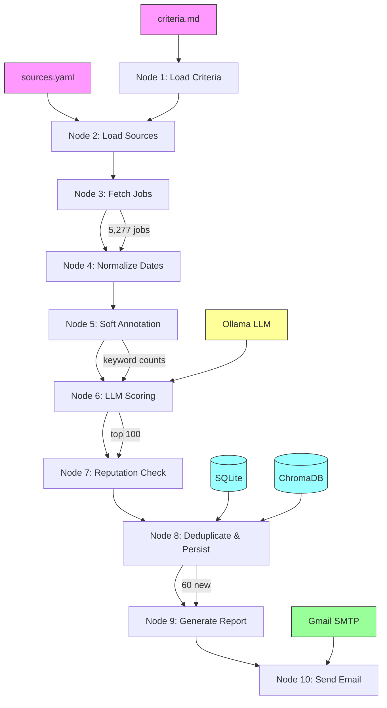

# 📚 Agentic AI Job Search Agent — Comprehensive Documentation

> **Version**: 0.1.0 | **License**: MIT | **Python**: ≥ 3.11  
> A fully local, open-source AI-powered job finder that runs entirely on your Mac.

---

## Table of Contents

1. [Business Problem](#1-business-problem)
2. [Solution Overview](#2-solution-overview)
3. [Key Concepts & Terminology](#3-key-concepts--terminology)
4. [Architecture](#4-architecture)
5. [Directory Structure](#5-directory-structure)
6. [Pipeline — The 10-Node LangGraph Workflow](#6-pipeline--the-10-node-langgraph-workflow)
7. [Data Models (Pydantic Schemas)](#7-data-models-pydantic-schemas)
8. [Job Source Fetchers](#8-job-source-fetchers)
9. [Agent Intelligence (LLM Scoring)](#9-agent-intelligence-llm-scoring)
10. [Storage Layer](#10-storage-layer)
11. [Report Generation & Email Delivery](#11-report-generation--email-delivery)
12. [Configuration Files](#12-configuration-files)
13. [CLI Interface](#13-cli-interface)
14. [Python Modules & Dependencies](#14-python-modules--dependencies)
15. [Testing](#15-testing)
16. [Scheduling (Automation)](#16-scheduling-automation)
17. [Deployment & Infrastructure](#17-deployment--infrastructure)

---

## 1. Business Problem

### The Challenge

Job seekers in the AI/ML space face a fragmented landscape:

- **Dozens of job boards** — LinkedIn, Indeed, Greenhouse, Lever, RemoteOK, We Work Remotely, etc. — each requiring separate searches.
- **High volume, low signal** — thousands of listings, most irrelevant to your specific criteria (role, seniority, salary, remote preference).
- **Manual effort** — checking multiple sites daily is time-consuming and error-prone. Relevant postings get buried or expire.
- **No unified scoring** — no way to automatically rank jobs by relevance to your unique preferences.
- **Privacy concerns** — commercial job aggregators track your data, sell your profile, and require account creation.

### The Solution

This agent **automates the entire job discovery pipeline**:

1. **Fetches** thousands of jobs from 50+ sources via public APIs and RSS feeds.
2. **Annotates** each job with keyword relevance scores.
3. **Scores** top candidates using a local LLM (Ollama) — no data leaves your machine.
4. **Deduplicates** using both exact-match (URL/title) and semantic similarity (vector embeddings).
5. **Generates** a curated HTML/Markdown report sorted by relevance.
6. **Emails** results to you via Gmail SMTP.
7. **Runs on a schedule** — daily or weekly, via macOS launchd or cron.

**Zero cost. Zero data sharing. Fully local.**

---

## 2. Solution Overview

```
┌─────────────────────────────────────────────────────────────────┐
│                         Job Search Agent                        │
│                                                                 │
│  criteria.md  ──→  Pipeline (LangGraph)  ──→  Email Report     │
│  sources.yaml ──↗                           ↘  reports/*.html  │
│                                                                 │
│  Infrastructure:                                                │
│  • Ollama (local LLM)     • SQLite (job history)               │
│  • ChromaDB (embeddings)  • Gmail SMTP (email)                 │
│  • SearXNG (optional)     • macOS launchd (scheduling)         │
└─────────────────────────────────────────────────────────────────┘
```

### How It Works (High-Level)

1. **You configure** your preferences in `criteria.md` (keywords, salary range, remote preference).
2. **You define** which job boards to scrape in `sources.yaml`.
3. **You run** `python main.py --mode daily` (or schedule it).
4. The agent fetches 5,000+ jobs, scores the top 100 by keyword relevance, deduplicates against past runs, and emails you a curated report.

---

## 3. Key Concepts & Terminology

### Agentic AI
An **AI agent** is software that autonomously performs tasks — in this case, searching for jobs, evaluating them, and reporting results. Unlike a simple script, an agent makes *decisions*: which jobs are relevant, how to score them, what to report.

### LangGraph
A framework by LangChain for building **stateful, multi-step AI workflows** as directed graphs. Each node is a function that reads/modifies shared state. Nodes execute sequentially, with data flowing through the pipeline.

### LangChain
An open-source framework for building applications powered by language models. Provides abstractions for LLMs, prompts, chains, and tools. This project uses LangChain's Ollama integration for local LLM inference.

### Ollama
A tool for running **large language models locally** on your machine (Mac, Linux, Windows). Supports models like Llama 3, Mistral, Gemma, and more. No internet required after initial model download.

### Pydantic
A Python library for **data validation using type annotations**. All data models in this project (jobs, criteria, scoring output) are Pydantic `BaseModel` classes, ensuring type safety and automatic validation.

### ChromaDB
An open-source **vector database** for similarity search. Stores job descriptions as numerical embeddings and finds semantically similar documents. Used here for **semantic deduplication** — detecting near-duplicate job postings even when the text differs slightly.

### Vector Embedding
A fixed-length numerical representation of text that captures semantic meaning. Similar texts produce similar vectors. ChromaDB uses ONNX MiniLM-L6-V2 to generate 384-dimensional embeddings from job descriptions.

### Cosine Similarity
A metric measuring the angle between two vectors (range: -1 to 1). A similarity of 0.92+ indicates near-identical content. Used as the threshold for semantic deduplication.

### RSS (Really Simple Syndication)
An XML-based format for publishing frequently updated content. Many job boards (We Work Remotely, Hacker News) expose job listings as RSS feeds that can be parsed programmatically.

### Greenhouse / Lever
**Applicant Tracking Systems (ATS)** used by tech companies. Both expose public APIs for their job boards:
- Greenhouse: `boards-api.greenhouse.io/v1/boards/{company}/jobs`
- Lever: `jobs.lever.co/{company}?format=rss`

### SearXNG
A **privacy-respecting metasearch engine** that can be self-hosted via Docker. Used optionally for company reputation checks.

### Gmail App Password
A 16-character password generated from Google Account settings that allows third-party apps to send email via Gmail SMTP without exposing your main password.

### Deduplication
The process of identifying and removing **duplicate job postings**. This agent uses three layers:
1. **URL exact match** — same job URL seen in a prior run
2. **Fuzzy key match** — normalized `company|title` string matches
3. **Semantic match** — vector embedding similarity > 0.92

---

## 4. Architecture



### Data Flow Summary

| Stage | Input | Output | Volume |
|---|---|---|---|
| Fetch | 51 source configs | Raw `JobModel` list | ~5,277 |
| Annotate | Raw jobs + criteria keywords | Jobs with `keyword_matches:N` flags | ~5,277 |
| Score (dry-run) | Annotated jobs | Top 100 by keyword count | 100 |
| Score (full) | Annotated jobs | LLM-scored `JobModel`s | varies |
| Deduplicate | Scored jobs | New unseen jobs | ~60 |
| Report | New jobs | `.md` + `.html` files | 1 report |
| Email | HTML report | Gmail delivery | 1 email |

---

## 5. Directory Structure

```
job-search-agent/
├── main.py                     # CLI entrypoint — argparse, logging, pipeline invocation
├── criteria.md                 # Human-editable job search preferences
├── sources.yaml                # Job board API/RSS source configuration
├── pyproject.toml              # Python project metadata & dependencies
├── docker-compose.yml          # SearXNG container for reputation checks
├── .env                        # Secrets (Gmail password, API keys) — gitignored
├── .env.example                # Template for .env with all variables
├── .gitignore                  # Git ignore rules
├── README.md                   # Quick-start guide
├── DOCUMENTATION.md            # This file — comprehensive documentation
│
├── src/                        # Application source code
│   ├── __init__.py
│   ├── graph.py                # LangGraph pipeline — 10 nodes, state management
│   │
│   ├── agents/                 # AI/ML agent logic
│   │   ├── __init__.py
│   │   ├── criteria_parser.py  # Parses criteria.md → CriteriaModel
│   │   ├── scoring.py          # LLM-based job scoring via Ollama
│   │   └── reputation.py       # Company reputation checker (SearXNG)
│   │
│   ├── models/                 # Pydantic data models
│   │   ├── __init__.py
│   │   ├── job.py              # JobModel — normalized job listing schema
│   │   ├── criteria.py         # CriteriaModel — parsed search preferences
│   │   └── scoring.py          # LLMScoringOutput — LLM response schema
│   │
│   ├── report/                 # Report generation & delivery
│   │   ├── __init__.py
│   │   ├── renderer.py         # Markdown + HTML report renderers
│   │   └── email_sender.py     # Gmail SMTP sender
│   │
│   ├── storage/                # Persistence layer
│   │   ├── __init__.py
│   │   ├── database.py         # SQLite — job history, dedup, run logs
│   │   └── vector_store.py     # ChromaDB — semantic deduplication
│   │
│   └── tools/                  # External API integrations
│       ├── __init__.py
│       ├── sources.py          # 7 fetcher functions (RemoteOK, RSS, Greenhouse, etc.)
│       ├── html_cleaner.py     # HTML → plain text conversion
│       └── searx_tool.py       # SearXNG web search wrapper
│
├── tests/                      # pytest test suite
│   ├── test_criteria.py        # Criteria parsing tests
│   ├── test_scoring_schema.py  # LLM scoring output validation tests
│   └── test_dedupe.py          # Deduplication logic tests
│
├── schedule/                   # Automation configs
│   ├── crontab.txt             # Linux/Mac cron schedule
│   └── com.jobsearch.agent.plist  # macOS launchd plist
│
├── reports/                    # Generated reports (gitignored)
│   ├── 2026-02-22.md
│   └── 2026-02-22.html
│
├── logs/                       # Runtime logs (gitignored)
│   └── run_2026-02-22.log
│
├── jobs.db                     # SQLite database (gitignored)
└── chroma_db/                  # ChromaDB vector store (gitignored)
```

---

## 6. Pipeline — The 10-Node LangGraph Workflow

**File**: [graph.py](file:///Users/agastya/antigravity/job-search-agent/src/graph.py)

The pipeline is built using LangGraph's `StateGraph`. All nodes share a `PipelineState` TypedDict:

```python
class PipelineState(TypedDict, total=False):
    mode: str              # "daily" or "weekly"
    dry_run: bool          # Skip LLM scoring
    no_email: bool         # Skip email sending
    criteria: CriteriaModel | None
    raw_jobs: list[JobModel]
    filtered_jobs: list[JobModel]
    scored_jobs: list[JobModel]
    matched_jobs: list[JobModel]
    new_jobs: list[JobModel]
    total_fetched: int
    total_filtered: int
    total_matched: int
    total_new: int
    report_md: str
    report_html: str
    email_sent: bool
    errors: list[str]
```

### Node 1: Load Criteria

Reads `criteria.md` and parses it into a structured `CriteriaModel`. Overrides `posted_within_days` based on mode (1 for daily, 7 for weekly).

### Node 2: Load Sources

Reads `sources.yaml` and builds a list of enabled source configurations. Each source has a `type`, `url` or `company_slug`, and `enabled` flag.

### Node 3: Fetch Jobs

Calls the appropriate fetcher function for each source type:

| Source Type | Fetcher Function | API/Protocol |
|---|---|---|
| `remoteok_api` | `fetch_remoteok()` | JSON REST API |
| `rss` | `fetch_rss()` | RSS/XML (feedparser) |
| `greenhouse` | `fetch_greenhouse()` | JSON REST API |
| `lever` | `fetch_lever()` | RSS/XML |
| `remotive` | `fetch_remotive()` | JSON REST API |
| `jobicy` | `fetch_jobicy()` | JSON REST API |
| `himalayas` | `fetch_himalayas()` | JSON REST API |

Each fetcher normalizes raw data into `JobModel` instances, inferring employment type, remote status, and salary from text.

### Node 4: Normalize Dates

Parses various date formats (RFC 822, ISO 8601, etc.) into ISO format. Adds a `missing_salary` flag for jobs without salary data.

### Node 5: Soft Annotation (No Hard Filter)

All jobs pass through — no filtering. Computes a `keyword_matches:N` count for each job, stored in the `flags` field for downstream relevance sorting.

```python
for job in raw_jobs:
    if criteria and criteria.keywords:
        text_lower = (job.title + " " + job.description).lower()
        matches = sum(1 for kw in criteria.keywords if kw.lower() in text_lower)
        job.flags.append(f"keyword_matches:{matches}")
    job.hard_filter_passed = True
```

### Node 6: Semantic Scoring (LLM)

**In dry-run mode**: Sorts all jobs by keyword match count (descending), takes the top 100, and assigns a default score of 5.

**In full mode**: Sends each job to the local Ollama LLM with a structured prompt, asking it to score relevance 1–10 and provide reasons. Splits results into matched (score ≥ `min_llm_score`) and borderline (score = `min_llm_score - 1`).

### Node 7: Reputation Check

For each matched job, optionally queries SearXNG for company reputation information (Glassdoor ratings, news sentiment). Assigns a reputation score (1–10).

### Node 8: Deduplicate & Persist

Three-layer deduplication:
1. **URL match** — SQLite lookup for exact URL
2. **Fuzzy key match** — normalized `company|title` key lookup
3. **Semantic match** — ChromaDB vector similarity (threshold 0.92)

New jobs are inserted into both SQLite and ChromaDB.

### Node 9: Generate Report

Sorts remaining jobs by multi-factor relevance:
```python
(keyword_match_count, llm_score, reputation_score, posted_date)  # descending
```

Renders both Markdown and HTML reports with job details, scores, and apply links. Saves to `reports/` directory.

### Node 10: Send Email

Sends the HTML report via Gmail SMTP. **Always sends**, even if no new jobs were found (sends a summary report). Subject line adapts:
- New jobs: `🔍 X New Job Matches — 2026-02-22`
- No new: `📋 Job Search Report (5277 scanned, 0 new) — 2026-02-22`

---

## 7. Data Models (Pydantic Schemas)

### JobModel — [job.py](file:///Users/agastya/antigravity/job-search-agent/src/models/job.py)

The central data structure. Every job from every source is normalized into this schema:

```python
class JobModel(BaseModel):
    title: str                                    # "Staff AI Engineer"
    company: str                                  # "Coinbase"
    url: str                                      # Apply link
    source: str                                   # "Greenhouse (coinbase)"
    posted_date: str | None                       # ISO format
    employment_type: EmploymentType               # Enum: full_time, contract, etc.
    remote_type: RemoteType                       # Enum: remote, hybrid, onsite
    salary_text: str | None                       # Raw salary string
    salary_min: int | None                        # Parsed min salary (annual)
    salary_max: int | None                        # Parsed max salary (annual)
    location: str | None                          # "Remote - USA"
    description: str                              # Clean text (HTML stripped)
    flags: list[str]                              # ["keyword_matches:5", "missing_salary"]
    llm_score: int | None                         # 1-10 from LLM
    llm_reasons: list[str]                        # Why the LLM scored it this way
    is_match: bool                                # Passed scoring threshold
    reputation_score: int | None                  # 1-10 company reputation
```

**Computed fields**:
- `job_id` — SHA-256 hash of `url|company|title`, truncated to 16 chars. Stable across runs.
- `dedupe_key` — Normalized `company|title` with only alphanumeric chars. For fuzzy matching.

### CriteriaModel — [criteria.py](file:///Users/agastya/antigravity/job-search-agent/src/models/criteria.py)

Structured representation of the user's search preferences:

```python
class CriteriaModel(BaseModel):
    fully_remote: bool = True
    full_time_only: bool = True
    min_salary: int | None = None       # e.g., 150000
    max_salary: int | None = None       # e.g., 300000
    keywords: list[str]                 # ["agentic AI", "LLM", "ML engineer", ...]
    seniority: list[str]                # ["senior", "staff", "principal", ...]
    exclude_keywords: list[str]         # ["intern", "junior", "part-time", ...]
    posted_within_days: int = 1         # Overridden by --mode daily/weekly
    min_llm_score: int = 7              # Threshold for matching
    max_results_per_email: int = 30     # Cap on report size
    raw_text: str                       # Full criteria.md text for LLM prompts
```

### LLMScoringOutput — [scoring.py](file:///Users/agastya/antigravity/job-search-agent/src/models/scoring.py)

Strict JSON schema that the LLM must produce:

```python
class LLMScoringOutput(BaseModel):
    is_match: bool                                   # True if score >= threshold
    score: int = Field(ge=1, le=10)                  # Relevance score
    reasons: list[str] = Field(default_factory=list)  # Max 6 bullet points
    flags: list[str]                                  # Issue flags
    confidence: Literal["low", "medium", "high"]      # LLM self-assessment
```

---

## 8. Job Source Fetchers

**File**: [sources.py](file:///Users/agastya/antigravity/job-search-agent/src/tools/sources.py) (~760 lines)

### Fetcher Architecture

All fetchers share the same pattern:
1. Make HTTP request (via `httpx`)
2. Parse response (JSON or RSS/XML)
3. Normalize into `JobModel` instances
4. Infer missing fields (remote type, employment type, salary)
5. Return `list[JobModel]`

### RemoteOK API — `fetch_remoteok()`

```python
# Endpoint: GET https://remoteok.com/api
# Response: JSON array (first element is metadata, skip it)
# Fields: position, company, url, date, salary_min, salary_max, tags, description
```

### Remotive API — `fetch_remotive()`

```python
# Endpoint: GET https://remotive.com/api/remote-jobs
# Response: JSON { "jobs": [...] }
# Fields: title, company_name, url, publication_date, salary, tags, job_type
```

Remotive is the **highest-volume source** (~2,300 jobs per fetch).

### Greenhouse JSON API — `fetch_greenhouse()`

```python
# Endpoint: GET https://boards-api.greenhouse.io/v1/boards/{slug}/jobs?content=true
# Response: JSON { "jobs": [...] }
# Fields: title, absolute_url, content (HTML), location.name, updated_at
```

The `?content=true` parameter includes full job descriptions. This replaced the broken RSS approach.

### Lever RSS — `fetch_lever()`

```python
# Endpoint: GET https://jobs.lever.co/{slug}?format=rss
# Response: RSS/XML feed
# Parsed with feedparser
```

### Jobicy API — `fetch_jobicy()`

```python
# Endpoint: GET https://jobicy.com/api/v2/remote-jobs?count=50
# Response: JSON { "jobs": [...] }
# Fields: jobTitle, companyName, url, pubDate, jobGeo, annualSalaryMin/Max
```

### Himalayas API — `fetch_himalayas()`

```python
# Endpoint: GET https://himalayas.app/jobs/api?limit=50
# Response: JSON { "jobs": [...] }
# Fields: title, companyName, applicationUrl, description, minSalary, maxSalary
```

### RSS (Generic) — `fetch_rss()`

Handles any RSS feed (We Work Remotely, HN Who Is Hiring):

```python
# Uses feedparser to parse RSS/Atom feeds
# Extracts: title, link, summary/description, published date
# Infers company from title patterns ("Title at Company")
```

### Helper Functions

| Function | Purpose |
|---|---|
| `_infer_remote_type(text)` | Detects "fully remote", "hybrid", "onsite" from text |
| `_infer_employment_type(text)` | Detects "full-time", "contract", "internship" from text |
| `_extract_salary(text)` | Regex extraction of `$X–$Y` salary ranges |
| `_parse_int(value)` | Safely parses integers from `$150,000` or `150k` |

---

## 9. Agent Intelligence (LLM Scoring)

**File**: [scoring.py](file:///Users/agastya/antigravity/job-search-agent/src/agents/scoring.py) (~255 lines)

### How the LLM Scores Jobs

Each job is scored by sending a structured prompt to the local Ollama LLM:

```
You are a job matching expert. Evaluate this job against the candidate's criteria.

CRITERIA:
{formatted criteria text}

JOB LISTING:
Title: {title}
Company: {company}
Location: {location}
Salary: {salary}
Description: {first 2000 chars of description}

Respond with this exact JSON format:
{
    "is_match": true/false,
    "score": 1-10,
    "reasons": ["reason1", "reason2", ...],
    "flags": ["flag1", ...],
    "confidence": "low" | "medium" | "high"
}
```

### Decision Logic

The LLM makes three key decisions:
1. **is_match** — Does this job meet the candidate's core requirements?
2. **score** — How well does it align (1 = poor, 10 = perfect)?
3. **confidence** — How certain is the LLM about its assessment?

### Error Handling & Retry

```python
def score_job(job, criteria, ollama_base_url, model):
    # Attempt 1: Send prompt, parse JSON response
    response = _call_ollama(prompt, base_url, model)
    result = _parse_scoring_output(response)

    if result is None:
        # Attempt 2: Send repair prompt with original response
        repair_prompt = REPAIR_PROMPT.format(previous_response=response)
        response = _call_ollama(repair_prompt, base_url, model)
        result = _parse_scoring_output(response)

    return result  # LLMScoringOutput or None
```

### JSON Extraction

The `_extract_json()` function handles LLMs that wrap JSON in markdown code blocks or add extra text:

```python
def _extract_json(text: str) -> dict | None:
    # Try direct JSON parse
    # Try extracting from ```json ... ``` blocks
    # Try finding { ... } with regex
    # Return None if all fail
```

### Criteria Parser

**File**: [criteria_parser.py](file:///Users/agastya/antigravity/job-search-agent/src/agents/criteria_parser.py)

Parses human-readable `criteria.md` into structured `CriteriaModel`:

```python
def parse_criteria(filepath: str = "criteria.md") -> CriteriaModel:
    # Read file content
    # Use regex to find patterns like:
    #   "- Keywords: agentic AI, LLM, ..."  → keywords list
    #   "- Minimum salary: 150000"          → min_salary int
    #   "- Fully remote: yes"               → fully_remote bool
    # Return CriteriaModel with parsed + defaults
```

### Reputation Checker

**File**: [reputation.py](file:///Users/agastya/antigravity/job-search-agent/src/agents/reputation.py)

Optionally queries SearXNG for company reviews:

```python
def check_reputation(company: str, searxng_url: str, enabled: bool) -> dict:
    if not enabled:
        return {"reputation_score": 5, "evidence": []}
    # Query SearXNG for "{company} glassdoor reviews"
    # Parse results for rating signals
    # Return score (1-10) + evidence list
```

---

## 10. Storage Layer

### SQLite Database — [database.py](file:///Users/agastya/antigravity/job-search-agent/src/storage/database.py)

**Purpose**: Persistent job history, deduplication, and run metadata.

#### Schema

```sql
-- Jobs table: stores every matched job ever seen
CREATE TABLE IF NOT EXISTS jobs (
    job_id          TEXT PRIMARY KEY,     -- SHA-256 hash
    url             TEXT NOT NULL UNIQUE, -- Apply link
    dedupe_key      TEXT NOT NULL,        -- Normalized company|title
    title           TEXT NOT NULL,
    company         TEXT NOT NULL,
    source          TEXT,
    posted_date     TEXT,
    salary_text     TEXT,
    salary_min      INTEGER,
    salary_max      INTEGER,
    location        TEXT,
    remote_type     TEXT,
    employment_type TEXT,
    description     TEXT,
    llm_score       INTEGER,
    llm_reasons     TEXT,                -- JSON list
    is_match        INTEGER DEFAULT 0,
    reputation_score INTEGER,
    flags           TEXT,                -- JSON list
    run_date        TEXT NOT NULL,
    created_at      TEXT NOT NULL DEFAULT (datetime('now'))
);

-- Run history: logs every pipeline execution
CREATE TABLE IF NOT EXISTS runs (
    run_id          INTEGER PRIMARY KEY AUTOINCREMENT,
    run_date        TEXT NOT NULL,
    mode            TEXT NOT NULL,        -- "daily" or "weekly"
    total_fetched   INTEGER DEFAULT 0,
    total_filtered  INTEGER DEFAULT 0,
    total_matched   INTEGER DEFAULT 0,
    total_emailed   INTEGER DEFAULT 0,
    errors          TEXT,                -- JSON list
    duration_secs   REAL,
    created_at      TEXT NOT NULL DEFAULT (datetime('now'))
);
```

#### Deduplication Logic

```python
class JobRepository:
    def is_duplicate(self, job: JobModel) -> bool:
        # Layer 1: Exact URL match
        if self.job_exists_by_url(job.url):
            return True
        # Layer 2: Fuzzy company|title match
        if self.job_exists_by_dedupe_key(job.dedupe_key):
            return True
        return False
```

### ChromaDB Vector Store — [vector_store.py](file:///Users/agastya/antigravity/job-search-agent/src/storage/vector_store.py)

**Purpose**: Semantic deduplication using vector embeddings.

```python
class VectorStore:
    def is_semantic_duplicate(self, text: str, threshold: float = 0.92) -> bool:
        """Check if a very similar job description already exists."""
        similar = self.find_similar(text, threshold=threshold)
        return len(similar) > 0

    def find_similar(self, text: str, threshold: float = 0.92) -> list[dict]:
        """Query Chroma for similar documents.
        Cosine distance: 0 = identical, 2 = opposite.
        Similarity = 1 - distance. Match if similarity >= threshold."""
        results = self._collection.query(query_texts=[text], n_results=5)
        return [r for r in results if (1 - r.distance) >= threshold]
```

Uses **lazy initialization** — ChromaDB is only loaded when the dedup node runs, avoiding import overhead when not needed.

---

## 11. Report Generation & Email Delivery

### Report Renderer — [renderer.py](file:///Users/agastya/antigravity/job-search-agent/src/report/renderer.py)

Generates two output formats:

**Markdown** (`reports/YYYY-MM-DD.md`):
```markdown
# Job Search Results — 2026-02-22 (daily)

## Summary
- **Total fetched**: 5277
- **Semantic matches**: 100
- **New (not seen before)**: 60

## Top Matches

### 1. Staff Software Engineer (AI Platform)
**Coinbase**
📍 Remote - USA
💰 $218,025
⭐ Score: 8/10 (confidence: high)
🔗 [Apply](https://www.coinbase.com/careers/...)
```

**HTML** (`reports/YYYY-MM-DD.html`):
A fully styled, responsive HTML email with:
- Gradient header with summary stats
- Individual job cards with scores, salary, location
- Apply links and keyword match indicators
- Footer with generation timestamp

### Email Sender — [email_sender.py](file:///Users/agastya/antigravity/job-search-agent/src/report/email_sender.py)

Uses Python's built-in `smtplib` with Gmail SMTP:

```python
def send_report_email(html_body, text_body, subject, from_addr, to_addr, password):
    msg = MIMEMultipart("alternative")
    msg.attach(MIMEText(text_body, "plain", "utf-8"))   # Fallback
    msg.attach(MIMEText(html_body, "html", "utf-8"))    # Preferred

    with smtplib.SMTP("smtp.gmail.com", 587) as server:
        server.starttls()                                # Encrypt connection
        server.login(from_addr, password)                # Gmail App Password
        server.sendmail(from_addr, to_addr, msg.as_string())
```

---

## 12. Configuration Files

### criteria.md

Human-readable search preferences:

```markdown
# Job Search Criteria

## Work Arrangement
- Fully remote: yes
- Full-time only: yes
- Avoid hourly: yes
- Avoid contract/1099: yes

## Compensation
- Minimum salary: 150000
- Maximum salary: 300000

## Roles & Keywords
- Keywords: agentic AI, AI agent, LLM, large language model, ML engineer, ...
- Seniority: senior, staff, principal, lead, manager, director

## Exclusions
- Exclude keywords: intern, internship, junior, entry level, part-time

## Scoring
- Minimum LLM score: 7
- Max results per email: 30
```

### sources.yaml

Job source configuration with 51 entries across 7 source types:

```yaml
sources:
  # Aggregators
  - name: RemoteOK
    type: remoteok_api
    url: https://remoteok.com/api
    enabled: true

  - name: Remotive
    type: remotive
    url: https://remotive.com/api/remote-jobs
    enabled: true

  # Company-specific (Greenhouse JSON API)
  - name: Stripe
    type: greenhouse
    company_slug: stripe
    enabled: true

  # Company-specific (Lever RSS)
  - name: Netflix
    type: lever
    company_slug: netflix
    enabled: true
```

### .env

Secrets and configuration (gitignored):

```bash
# LLM
OLLAMA_BASE_URL=http://localhost:11434
OLLAMA_MODEL=llama3

# Email
GMAIL_ADDRESS=you@gmail.com
GMAIL_APP_PASSWORD=xxxx xxxx xxxx xxxx
RECIPIENT_EMAIL=you@gmail.com

# Storage
DB_PATH=jobs.db
CHROMA_PATH=./chroma_db

# Optional
SEARXNG_URL=http://localhost:8888
SEARXNG_ENABLED=false
LOG_LEVEL=INFO
```

### docker-compose.yml

Optional SearXNG container for reputation checks:

```yaml
services:
  searxng:
    image: searxng/searxng:latest
    ports:
      - "8888:8080"
    environment:
      - SEARXNG_BASE_URL=http://localhost:8888
```

---

## 13. CLI Interface

**File**: [main.py](file:///Users/agastya/antigravity/job-search-agent/main.py)

```bash
# Daily job search (last 24 hours)
python main.py --mode daily

# Weekly digest (last 7 days)
python main.py --mode weekly

# Dry run — skip LLM scoring, still sends email
python main.py --mode daily --dry-run

# Skip email — only generate reports
python main.py --mode daily --no-email

# Custom criteria and sources
python main.py --criteria my_criteria.md --sources my_sources.yaml

# Debug logging
python main.py --mode daily --log-level DEBUG
```

### Flags

| Flag | Description |
|---|---|
| `--mode daily` | Search for jobs posted in the last 24 hours |
| `--mode weekly` | Search for jobs posted in the last 7 days |
| `--dry-run` | Skip LLM scoring (assign default score 5), still emails |
| `--no-email` | Only way to suppress email sending |
| `--criteria PATH` | Custom criteria file (default: `criteria.md`) |
| `--sources PATH` | Custom sources file (default: `sources.yaml`) |
| `--log-level LEVEL` | DEBUG, INFO, WARNING, ERROR |

---

## 14. Python Modules & Dependencies

### Core Dependencies

| Package | Version | Purpose |
|---|---|---|
| `langchain` | ≥0.3.0 | LLM framework — prompt templates, chains |
| `langchain-community` | ≥0.3.0 | Community integrations (Ollama, etc.) |
| `langchain-ollama` | ≥0.2.0 | Ollama LLM binding for LangChain |
| `langgraph` | ≥0.2.0 | Stateful graph workflow engine |
| `pydantic` | ≥2.0 | Data validation via type annotations |
| `chromadb` | ≥0.5.0 | Vector database for semantic dedup |
| `httpx` | ≥0.27 | Modern async-capable HTTP client |
| `feedparser` | ≥6.0 | RSS/Atom feed parser |
| `beautifulsoup4` | ≥4.12 | HTML parsing and cleaning |
| `lxml` | ≥5.0 | Fast XML/HTML parser backend |
| `pyyaml` | ≥6.0 | YAML config file parser |
| `python-dotenv` | ≥1.0 | Load `.env` file into environment |
| `jinja2` | ≥3.1 | Template engine (available for reports) |

### Standard Library Modules Used

| Module | Usage |
|---|---|
| `argparse` | CLI argument parsing in `main.py` |
| `logging` | Structured logging throughout the application |
| `sqlite3` | SQLite database access (no external driver needed) |
| `smtplib` | Gmail SMTP email sending |
| `email.mime` | Email message construction (MIME multipart) |
| `hashlib` | SHA-256 hashing for job IDs |
| `json` | JSON serialization/deserialization |
| `re` | Regex for salary extraction, date parsing |
| `enum` | Type-safe enumerations (RemoteType, EmploymentType) |
| `pathlib` | Cross-platform file path handling |
| `datetime` | Date parsing and timezone handling |
| `time` | Pipeline duration measurement |

### Dev Dependencies

| Package | Purpose |
|---|---|
| `pytest` | Test runner |
| `pytest-asyncio` | Async test support |

---

## 15. Testing

**Directory**: `tests/` | **Runner**: `pytest`

### Test Suites

#### test_criteria.py — Criteria Parsing

| Test | What It Validates |
|---|---|
| `test_parse_full_criteria` | All fields parsed correctly from a full `criteria.md` |
| `test_parse_missing_file_returns_defaults` | Graceful fallback when file doesn't exist |
| `test_parse_minimal_criteria` | Parsing a near-empty criteria file |
| `test_raw_text_preserved` | Full file text stored in `raw_text` for LLM prompts |
| `test_salary_with_commas` | Handles `150,000` → `150000` conversion |
| `test_boolean_no_values` | Handles missing boolean values |

#### test_scoring_schema.py — LLM Output Validation

| Test | What It Validates |
|---|---|
| `test_valid_scoring_output` | Well-formed LLM response parses correctly |
| `test_invalid_score_too_high` | Score > 10 raises ValidationError |
| `test_invalid_score_too_low` | Score < 1 raises ValidationError |
| `test_reasons_truncated_to_six` | More than 6 reasons gets truncated |
| `test_from_json_string` | JSON string → Pydantic model parsing |
| `test_extra_fields_ignored` | Unknown fields don't cause errors |

#### test_dedupe.py — Deduplication Logic

| Test | What It Validates |
|---|---|
| `test_job_id_is_stable` | Same input always produces same hash |
| `test_dedupe_key_normalized` | Special characters stripped from dedupe keys |
| `test_insert_and_detect_url_duplicate` | URL-based dedup works |
| `test_insert_and_detect_fuzzy_duplicate` | Company|title-based dedup works |
| `test_run_logging` | Pipeline run metadata stored correctly |

### Running Tests

```bash
python -m pytest tests/ -v
# 23 passed in 0.05s
```

---

## 16. Scheduling (Automation)

### macOS launchd (Recommended)

**File**: `schedule/com.jobsearch.agent.plist`

```bash
# Install the schedule:
cp schedule/com.jobsearch.agent.plist ~/Library/LaunchAgents/
launchctl load ~/Library/LaunchAgents/com.jobsearch.agent.plist

# Runs daily at 8:00 AM
```

### Cron (Linux/Mac)

**File**: `schedule/crontab.txt`

```bash
# Add to crontab:
crontab -e
# Then add:
0 8 * * * cd /path/to/job-search-agent && python main.py --mode daily
0 8 * * 1 cd /path/to/job-search-agent && python main.py --mode weekly
```

---

## 17. Deployment & Infrastructure

### Prerequisites

| Component | Purpose | Install |
|---|---|---|
| Python 3.11+ | Runtime | `brew install python@3.11` |
| Ollama | Local LLM inference | `brew install ollama` |
| llama3 model | Scoring LLM | `ollama pull llama3` |
| Docker (optional) | SearXNG container | `brew install --cask docker` |

### Quick Start

```bash
# 1. Clone
git clone https://github.com/agstya/job-search-agent.git
cd job-search-agent

# 2. Create virtual environment
python -m venv .venv
source .venv/bin/activate

# 3. Install dependencies
pip install -e ".[dev]"

# 4. Configure
cp .env.example .env
# Edit .env with your Gmail App Password

# 5. Edit search criteria
nano criteria.md

# 6. Start Ollama
ollama serve &
ollama pull llama3

# 7. Run (dry-run first)
python main.py --mode daily --dry-run

# 8. Run for real
python main.py --mode daily
```

### Data Flow Diagram

```
                    ┌──────────────────┐
                    │   criteria.md    │
                    │   sources.yaml   │
                    │      .env        │
                    └───────┬──────────┘
                            │
                            ▼
┌──────────────────────────────────────────────────────┐
│                    main.py (CLI)                      │
│  • Parse args  • Load .env  • Build pipeline         │
└───────────────────────┬──────────────────────────────┘
                        │
                        ▼
┌──────────────────────────────────────────────────────┐
│              graph.py (LangGraph Pipeline)            │
│                                                       │
│  Node 1-2: Load config                                │
│  Node 3:   Fetch from 51 sources ──→ ~5,277 jobs     │
│  Node 4-5: Normalize + annotate keywords              │
│  Node 6:   LLM score (Ollama) ──→ top 100            │
│  Node 7:   Reputation check (SearXNG)                 │
│  Node 8:   Deduplicate ──→ ~60 new                   │
│  Node 9:   Render report  ──→ .md + .html            │
│  Node 10:  Send email ──→ Gmail SMTP                  │
└───────┬───────────┬───────────┬───────────────────────┘
        │           │           │
        ▼           ▼           ▼
    ┌────────┐  ┌────────┐  ┌──────────┐
    │ SQLite │  │ChromaDB│  │  Gmail   │
    │jobs.db │  │chroma/ │  │  SMTP    │
    └────────┘  └────────┘  └──────────┘
```

---

> **Generated**: 2026-02-22 | **Author**: Agentic AI Job Search Agent Team
